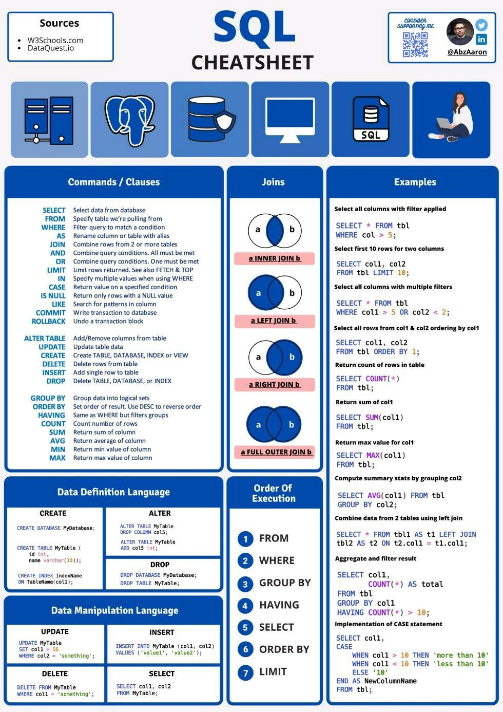

# Database L3

Sur cette repository, vous trouverez tout ce qui est en lien avec le cours "Bases de données avancées" de L3.

L'objectif du projet était de créer une base de données, intégrable à une application, et permettant de gérer un emploi du temps de façon efficace. Il fut réalisé en duo, avec [Jérémy Grelaud](https://github.com/jeremyGrelaud)

L'objectif du mini-projet était de créer une base de données pour qu'un laboratoire puisse répertorier l’ensemble de ses vecteurs de clonage de manière informatique.

L'image suivante est un résumé quasi parfait des bases du SQL. (source : AbzAaron)

